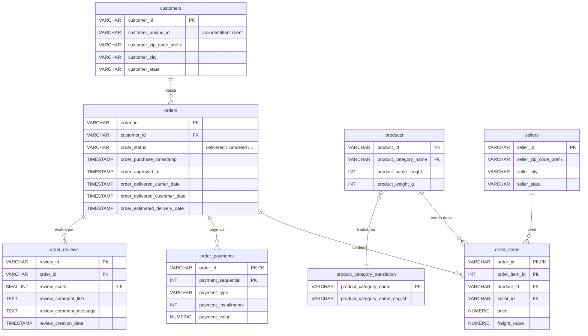
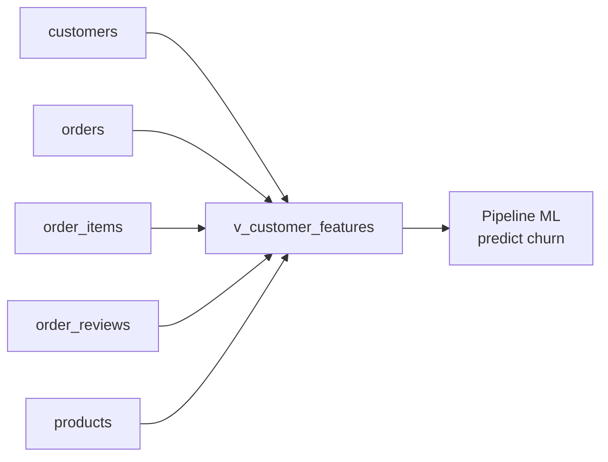

# Schéma de la base de données Olist

## Vue d'ensemble

Base relationnelle modélisant un e-commerce brésilien (2016-2018) :
- **8 tables** au total (7 entités métier + 1 table de traduction)
- **Volume** : ~100k commandes, ~99k clients, ~112k items, ~98k reviews
- **Convention** : tous les identifiants sont des hashes `VARCHAR(32)`

## Diagramme entité-relation

## Le piège `customer_id` vs `customer_unique_id`

Point crucial du dataset : Olist **régénère un `customer_id` à chaque commande**.
Pour identifier un vrai client (et calculer ses features), il faut utiliser `customer_unique_id`.

| Colonne | Nombre de valeurs distinctes | Sens |
|---------|-----------------------------|------|
| `customer_id` | 99 441 | Identifiant **par commande** (techniquement = 1 commande) |
| `customer_unique_id` | 96 096 | Identifiant **par personne** (le vrai client) |

C'est pour ça que tous les `GROUP BY` du feature engineering portent sur `customer_unique_id`.

## Vue analytique `v_customer_features`

Vue construite au-dessus de ces tables, agrégeant 9 features par client :

Colonnes de la vue :
- `customer_unique_id` - clé primaire logique
- `recency_days` - jours depuis la dernière commande
- `frequency` - nombre de commandes
- `total_spent` - montant total dépensé
- `avg_basket` - panier moyen
- `basket_trend` - évolution du panier (positif = en hausse)
- `avg_days_between_orders` - fréquence d'achat
- `avg_review_score` - satisfaction moyenne
- `pct_negative_reviews` - pourcentage 0-100 des reviews ≤ 2
- `category_diversity` - diversité catégorielle
